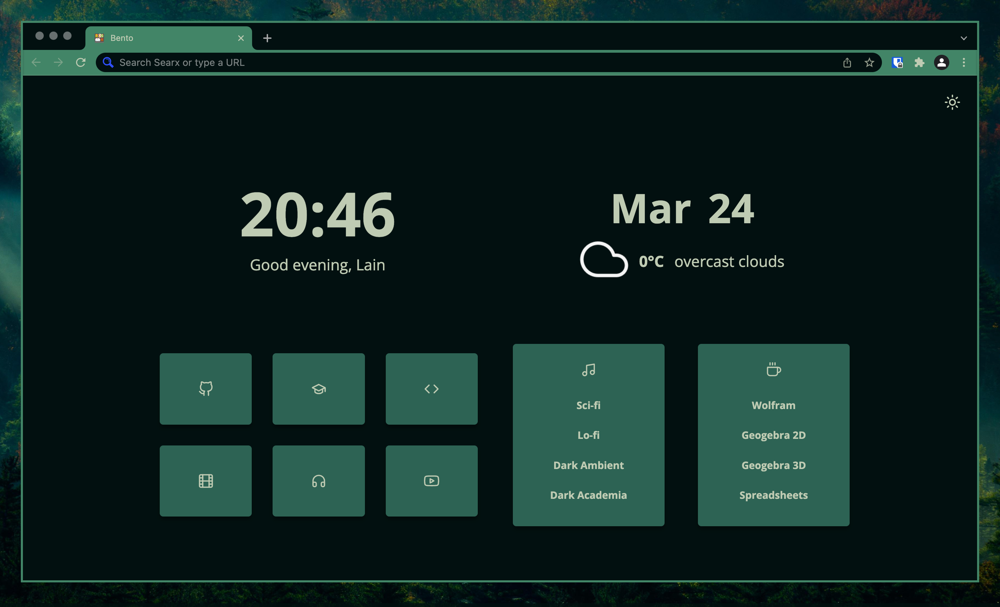

# Bento Pywal theme generator

Generates [pywal](https://github.com/dylanaraps/pywal) theme for [Bento](https://github.com/migueravila/Bento) startpage

## Usage

1. Open `generate-theme.sh` with any editor
2. Change `BENTO_DIR` varibale to the path for Bento source
3. Run `./generate-theme.sh`
4. ???
5. PROFIT!

You should run this script each time you update your pywal colors
