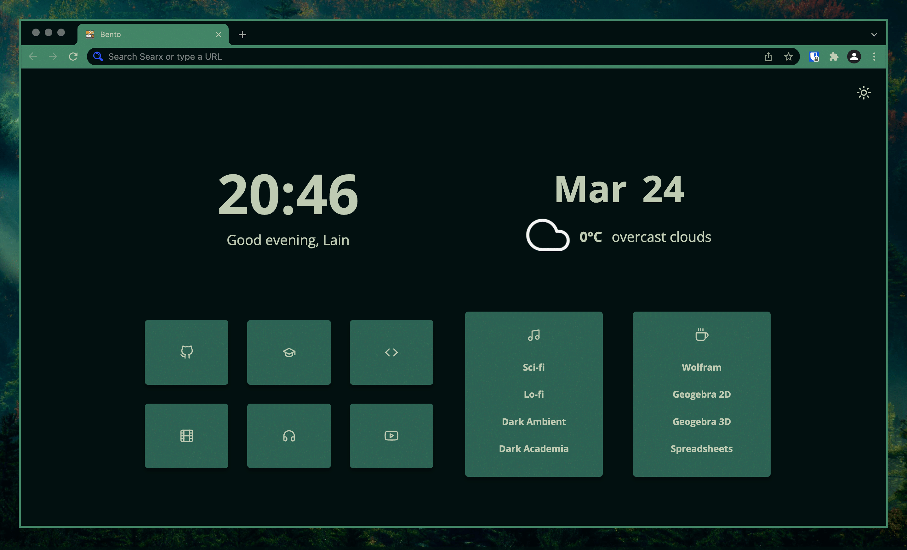

# Bento Pywal theme generator

Generates [pywal](https://github.com/dylanaraps/pywal) theme for [Bento](https://github.com/migueravila/Bento) startpage




## Usage

Run the command below. But you have to specify path for your folder with Bento.
To do it just open  `generate-theme.sh` and change `BENTO_DIR` variable
```bash
./generate-theme.sh
```
